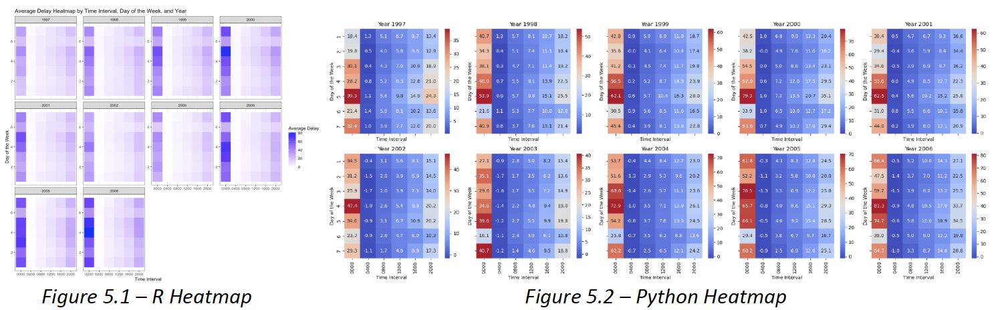
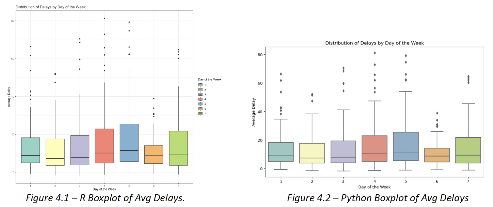
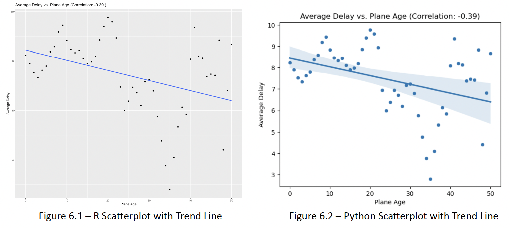

# US Flight Delay Analysis

As part of my **Programming for Data Science** coursework, this project analyzes US domestic flight data from the Havard Dataverse to answer key questions around flight delays and diversions.

This project was conducted in both **Python** and **R**, validating findings across both languages.

---

## Project Overview

The dataset contains flight arrival and departure details for all commercial flights on major carriers within the USA from **Oct 1987 to Apr 2008**, containing nearly **120 million records** (~1.6GB Compressed, ~12GB Uncompressed). 
To maximize analysis efficiency, I established a connection to an **SQLite Database** and used data from **10 consecutive years (1997-2006)** resulting in nearly **60 million** records for this analysis.

This project addresses 3 key questions:
1. **What are the best times and days to minimize flight delays each year?**  
2. **Do older aircraft experience more delays over time?**  
3. **Can we build a logistic regression model to predict the probability of flight diversions?**

---

## Key Features

- **Exploratory Analysis:** Trends by day-of-week, time-of-day, and seasonality for delay minimization.
- **Aircraft Age Analysis:** Investigated whether older aircraft are correlated with increased delays.
- **Predictive Modeling:** Built a **logistic regression model** to predict flight diversion probability.
- **Cross-Language Validation:** Implemented in **both Python and R** for reproducibility.

---

## Results

### 1. What are the best times and days to minimize flight delays?
- Boxplots of Average Delays:
  -  **Friday** (Day 5) consistently had the **highest Average Delays** across all seven days.
- Heatmaps of Average Delays cross the 10 years reveal a consistent pattern:
  - **Highest Delays:** Late-night/ Early-morning flights (00:00 - 04:00) experienced the longest delays.
  - **Lowest Delays:** Mid-morning to Early afternoon (08:00 - 14:00) experienced the shortest delays.
- These patterns remained consistent across all years, making mid-morning, mid-week flights the most reliable for minimizing delays.

  

*Heatmap of Average Delays by Time of Week (Python and R implementation)* 

  

*Boxplot of Average Delays across Day of Week (Python and R implementation)*

### 2. Do older aircraft experience more delays over time?
- The **Correlation Coefficient between Plane Age and Average Delay** was **-0.39**, indicating a **moderate negative relationship** between these two variables.
- A fitted trendline confirmed a **downward trend**:
  - **Older planes tend to experience slightly lower Average Delays** compared to newer planes.
- **Interpretation:**
  - **Younger planes** may be **more prone to operational issues** as they enter service, **leading to occasional delays.**
  - **Older planes** likely undergo **extensive maintenance and operational refinements**, contributing to **more reliable performance** despite their age.

  

*Scatterplot and Trendline showing relationship between Plane Age and Average Delay (Python and R implementation)*

### 3. Can we predict the probability of flight diversions using logistic regression?
- Built a **logistic regression model** using features:
  - **CRSDepTime:** Planned departure time of flight,
  - **CRSArrTime:** Planned Arrival time of flight,
  - **Distance:** Euclidean distance between departure and arrival airports, calculated using their associated longitudinal and latititude coordinates.
- **Key Findings:**
  - **Scheduled Departure/Arrival Time** (CRSDepTime & CRSArrTime):
    - **Earlier departures and arrivals** were associated with a **lower probability of diversion**.
    - Likely due to **fewer weather disruptions and reduced air traffic** during early hours.
  - **Flight Distance:**
    - **Longer flights** had a **higher probability of diversion**.
    - This may be due to **operational complexities** like fuel management and routing challenges.
- These insights provide practical implications for scheduling - earlier, shorter flights are statistically less prone to diversions.

---

## Skills Used

- **Programming Languages:** Python, R, SQLite
- **Data Analysis & Visualization:** pandas, ggplot2, matplotlib, seaborn  
- **Statistical Modeling:** Logistic Regression (statsmodels, glm in R)  
- **Data Wrangling:** Grouping, aggregating, and filtering large datasets  
- **Reproducible Reporting:** R Markdown, Jupyter Notebooks

---

## Files

- Python code for this project can be accessed [here](ST2195_Part_2.ipynb), and R code [here](https://nichkohlas.github.io/US-Flight-Delay-Analysis/220459392_Part_2.html).
- Written report for this project can be accessed [here](ST2195_Final.pdf). **(View part 2 onwards)**

